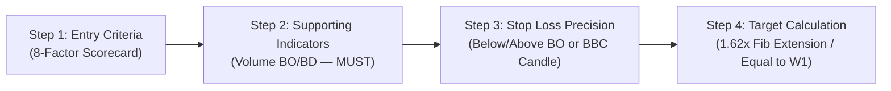
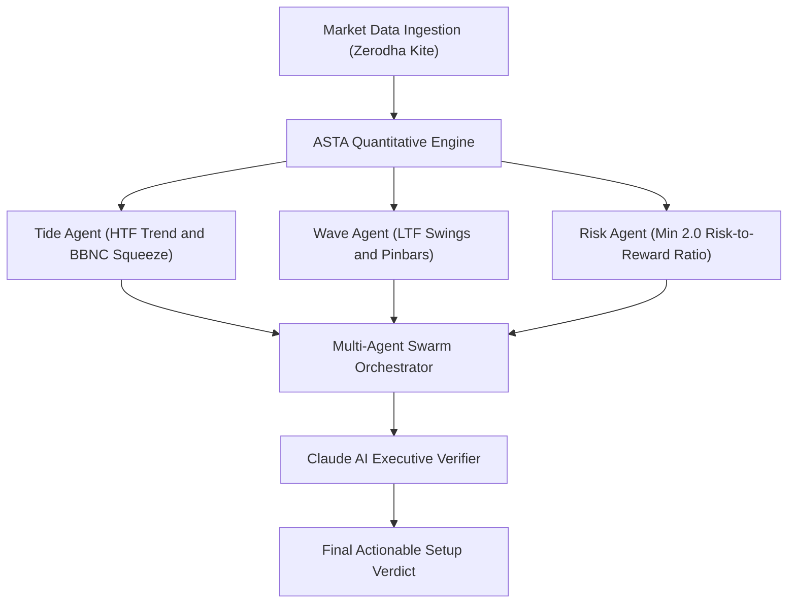

# AlphaTerminal — ASTA 3rd Wave Algorithmic Trading Platform

[](https://react.dev/)
[](https://nodejs.org/)
[](https://www.mongodb.com/)
[](https://kite.trade/)
[](https://anthropic.com/)
[](https://developer.mozilla.org/)

An institutional-grade full-stack algorithmic trading terminal, multi-symbol scanner, and technical evaluation platform based on the **Avadhut Sathe Trading Academy (ASTA) 3rd Wave Setup Checklist** and **Alexander Elder's Dual-Screen Principle**, powered by live **Zerodha KiteConnect** historical/real-time market data and an autonomous **Claude AI Multi-Agent Swarm Orchestrator**.

---

## 📑 Table of Contents

- [Core Modules & Capabilities](#-core-modules--capabilities)
- [ASTA 3rd Wave Setup Engine](#-asta-3rd-wave-setup-engine)
- [Multi-Agent Swarm Architecture](#-multi-agent-swarm-architecture)
- [Tech Stack](#-tech-stack)
- [Project Directory Structure](#-project-directory-structure)
- [Environment Configuration](#-environment-configuration)
- [Quick Start Guide](#-quick-start-guide)
- [Strategy Checklist Reference (Document Compliant)](#-strategy-checklist-reference-document-compliant)
- [Security & Architecture](#-security--architecture)

---

## 🚀 Core Modules & Capabilities

### 1. ASTA 3rd Wave Setup Hub
- **Multi-Symbol Universe Scanner**: Scans NIFTY 50, NIFTY BANK, NIFTY FIN SERVICE, and custom watchlists across multi-timeframe presets (Daily/60m, Weekly/Daily, Daily/15m, 60m/15m, 15m/5m, 5m/3m) or custom intervals.
- **Deep View Technical Modal**: Comprehensive modal inspection with interactive candlestick charts, 8-factor scorecards, Step 2 Volume MUST verification, stop loss / target references, and Claude AI executive reasoning.
- **Single Stock Deep Evaluator**: On-demand deep-dive for any Zerodha ticker with complete multi-timeframe alignment, trade action plans, and execution levels.

### 2. Interactive Trading Terminal & Charts
- High-performance canvas-based candlestick chart with dynamic timeframes (`1D`, `60m`, `15m`, `5m`, etc.).
- **Session Indicators**: Session Open (`O`) and Session Close (`C`) markers specifically placed on the first and last candle of each trading session.
- **Technical Overlays**: EMA9, EMA20, EMA50, EMA200, Bollinger Bands (20, 2), Volume series with 20-period moving average, and 14-period RSI oscillator.
- **Candle Math & Extraction Inspector**: Real-time extraction of ATR20, candle body/range percentages, wick ratios, fractal swings, and indicators for any selected candle.

### 3. Authentication & Security
- **Dual Authentication**: Native email/password authentication with `bcryptjs` and Google OAuth 2.0.
- **Role-Based Access Control (RBAC)**: Supports `trader`, `developer`, and `admin` roles with custom permission gates.
- **MongoDB Session Store**: Persistent server-side sessions with `connect-mongo`.
- **Security Protections**: Rate limiting (`express-rate-limit`), HTTP header security (`helmet`), and comprehensive logging (`winston`).
- **Zerodha Token Management**: Auto-loads and caches KiteConnect tokens with reconnect modals.

### 4. Glassmorphism Dual-Theme Design System
- Built with tailored CSS tokens supporting **Dark Terminal Mode** and **Institutional Sapphire Light Mode**.
- Responsive glassmorphism cards, micro-animations, glowing badges, and proportional login/dashboard layouts.

---

## 🌊 ASTA 3rd Wave Setup Engine

The strategy engine executes a 4-step quantitative verification compliant with the official ASTA checklist:



1. **Step 1 — Entry Criteria (8-Factor Scorecard)**:
   - **Tide (Higher Timeframe)**: Uptick/Downtick (Price vs EMA20), BBNC DN/UP (Bollinger squeeze / band touch), and Momentum RSI (`P > 50` / `P < 50`).
   - **Wave (Lower Timeframe)**: Two consecutive Higher Lows / Lower Highs (`Two HLs` / `Two LHs`), Trendline Breakout + Base Building Candle (`TLBO + BBC` / `TLBD + BBC`), Ungli Pinbar Reversal setup (`≥50% wick`), and Wave Momentum RSI (`P > 50` / `P < 50`).
   - **Double Screen Confirmation**: HTF Tide trend confirmation in alignment with LTF Wave timing trigger.
2. **Step 2 — Supporting Indicators (Volume — MUST)**:
   - Volume on the Breakout/Breakdown candle must be above the 20-period average (`≥ 1.3x avgVol20`). Mandatory gate for signal generation.
3. **Step 3 — Stop Loss Precision**:
   - **Long Trade**: Strictly placed **Below BO Candle / Below BBC Candle** (`Math.min(boCandle.low, bbcCandle.low)` - buffer).
   - **Short Trade**: Strictly placed **Above BD Candle / Above BBC Candle** (`Math.max(bdCandle.high, bbcCandle.high)` + buffer).
4. **Step 4 — Targets (Fibonacci Extension Tool)**:
   - **Target 1 (Primary 3rd Wave Target)**: `1.62x Wave 1 Extension` (1.618 Fib extension from Wave 2 pullback).
   - **Target 2 (Conservative Target)**: `1.0x Wave 1 Extension` (Equal to Wave 1 / Wave A).

---

## 🤖 Multi-Agent Swarm Architecture

The setup validation utilizes an autonomous multi-agent pipeline:



- **Tide Agent**: Inspects higher-timeframe trend direction, Bollinger Band squeeze (BBNC), and momentum posture.
- **Wave Agent**: Verifies fractal swing progression, base building candles, trendline breaks, and pinbar reversals.
- **Risk Agent**: Enforces a strict minimum **2.0:1 Risk-to-Reward Ratio** requirement before trade confirmation.
- **Claude AI Verifier**: Synthesizes agent traces into a concise institutional executive verdict.

---

## 🛠 Tech Stack

### Frontend
- **Framework**: React 18 with Vite
- **Icons**: Lucide React
- **Styles**: Custom Vanilla CSS Design System (`glassmorphism.css`)
- **State Management**: React Context (`AuthContext`)

### Backend
- **Runtime**: Node.js & Express.js
- **Database**: MongoDB with Mongoose ODM & Connect-Mongo session store
- **Market Data**: Zerodha KiteConnect API v5 & KiteTicker WebSocket client
- **Logging**: Winston logger with daily console and file transport
- **Security**: Helmet, Express Rate Limit, BcryptJS, Passport.js (Google OAuth 2.0)

---

## 📁 Project Directory Structure

```
Trading_Works/
├── backend/
│   ├── src/
│   │   ├── config/              # MongoDB, logger, and environment configs
│   │   ├── controllers/         # Auth, developer, and market controllers
│   │   ├── middleware/          # Auth verification, rate limiting, and error handlers
│   │   ├── models/              # User, Session, and Market data schemas
│   │   ├── routes/              # Auth, market, developer, AI, and 3-Wave routes
│   │   ├── services/            # Strategy facade, Zerodha fetchers, backtesters
│   │   ├── threeWave/           # ASTA 3rd Wave Strategy Core Engine
│   │   │   ├── agents/          # Tide, Wave, Risk, and Claude AI agent nodes
│   │   │   ├── data/            # Stock universes and Zerodha candle fetchers
│   │   │   ├── indicators/      # Bollinger, Candlestick (Ungli/BBC), Oscillators, Swings, Fibonacci
│   │   │   ├── strategy/        # Third wave scanner, evaluator, and backtester
│   │   │   └── utils/           # Scan progress tracker and telemetry
│   │   ├── utils/               # Helper utilities and session handlers
│   │   └── server.js            # Express application bootstrap & WebSocket server
│   ├── package.json
│   └── .env.example
├── frontend/
│   ├── src/
│   │   ├── components/          # React components (Charts, Modals, Forms, Scorecards)
│   │   │   ├── ThreeWaveStrategyPage.jsx   # Main ASTA 3rd Wave Setup Hub
│   │   │   ├── ThreeWaveSetupChart.jsx     # Technical Candlestick & Inspector Chart
│   │   │   ├── TradingOverviewPage.jsx     # Live Market Watch & Overview
│   │   │   ├── Dashboard.jsx               # Main Trading Portal Dashboard
│   │   │   ├── SignInForm.jsx              # Centered Authentication Portal
│   │   │   └── ...
│   │   ├── context/             # AuthContext and state providers
│   │   ├── styles/              # Glassmorphism design tokens & themes
│   │   ├── App.jsx              # Main React route & layout container
│   │   └── main.jsx             # React entry point
│   ├── index.html
│   ├── vite.config.js
│   └── package.json
├── package.json                 # Monorepo root scripts
└── README.md
```

---

## ⚙️ Environment Configuration

Create a `.env` file in `backend/.env` with the following variables:

```env
# Server Configuration
PORT=5000
NODE_ENV=development
CLIENT_URL=http://localhost:5173

# Database
MONGODB_URI=mongodb://127.0.0.1:27017/trading_auth_db
SESSION_SECRET=your_super_secret_session_key_here

# Zerodha KiteConnect Credentials
ZERODHA_API_KEY=your_zerodha_api_key
ZERODHA_API_SECRET=your_zerodha_api_secret
ZERODHA_ACCESS_TOKEN=your_zerodha_access_token_if_manual

# Anthropic Claude AI Credentials (Optional for Multi-Agent Swarm)
ANTHROPIC_API_KEY=your_claude_api_key
CLAUDE_MODEL_NAME=claude-sonnet-4-5-20250929

# Google OAuth (Optional for Social Login)
GOOGLE_CLIENT_ID=your_google_oauth_client_id
GOOGLE_CLIENT_SECRET=your_google_oauth_client_secret
GOOGLE_CALLBACK_URL=http://localhost:5000/api/auth/google/callback
```

---

## 🚀 Quick Start Guide

### Prerequisites
- Node.js (v18 or higher recommended)
- MongoDB running locally or MongoDB Atlas connection string

### 1. Installation
Install root and subproject dependencies:

```bash
# Install backend dependencies
cd backend
npm install

# Install frontend dependencies
cd ../frontend
npm install
```

### 2. Running Locally
Run the backend and frontend development servers concurrently:

```bash
# Terminal 1: Backend Server (runs on http://localhost:5000)
cd backend
npm run dev

# Terminal 2: Frontend Client (runs on http://localhost:5173)
cd frontend
npm run dev
```

Or run from the root directory:
```bash
npm run dev:backend
npm run dev:frontend
```

---

## 📋 Strategy Checklist Reference (Document Compliant)

| Step | Rule Description | Bullish Setup (Buy) | Bearish Setup (Sell) | Requirement |
|:---:|---|---|---|:---:|
| **1.1** | **Tide — Trend Filter** | Price > EMA 20 | Price < EMA 20 | Entry Criteria |
| **1.2** | **Tide — Bollinger Band** | BBNC - DN (Squeeze / Lower Band) | BBNC - UP (Squeeze / Upper Band) | Entry Criteria |
| **1.3** | **Tide — Momentum RSI** | RSI > 50 (Nice to have) | RSI < 50 (Nice to have) | Entry Criteria |
| **1.4** | **Wave — Swing Structure** | Two Consecutive Higher Lows (Two HLs) | Two Consecutive Lower Highs (Two LHs) | Entry Criteria |
| **1.5** | **Wave — Breakout + Base** | TLBO + BBC (Trendline BO + Base) | TLBD + BBC (Trendline BD + Base) | Entry Criteria |
| **1.6** | **Wave — Ungli Setup** | Bullish Pinbar (Lower wick ≥ 50%) | Bearish Pinbar (Upper wick ≥ 50%) | Entry Criteria |
| **1.7** | **Wave — Momentum RSI** | RSI > 50 | Price / RSI < 50 | Entry Criteria |
| **1.8** | **Wave — Double Screen** | Tide Trend + Wave Trigger Alignment | Tide Trend + Wave Trigger Alignment | Entry Criteria |
| **2** | **Supporting Indicators** | Volume > 1.3x 20-period Avg Volume | Volume > 1.3x 20-period Avg Volume | **MUST** |
| **3** | **Stop Loss Level** | **Below BO Candle / Below BBC Candle** | **Above BD Candle / Above BBC Candle** | Mandatory |
| **4** | **Target Projection** | **1.62x Wave 1 Extension** (or 1.0x Equal) | **1.62x Wave 1 Extension** (or 1.0x Equal) | Mandatory |

---

## 🔒 Security & Architecture

- **Audit Logging**: All authentication attempts, Zerodha API calls, and scanner operations are logged using `winston` with timestamps and session context.
- **Session Protection**: HTTP-only cookies with SameSite attributes, CSRF mitigation, and auto-timeout protection.
- **Cache Resilience**: Zerodha instrument master data and historical candles are cached to local disk to prevent rate-limit penalties while maintaining real-time precision.
